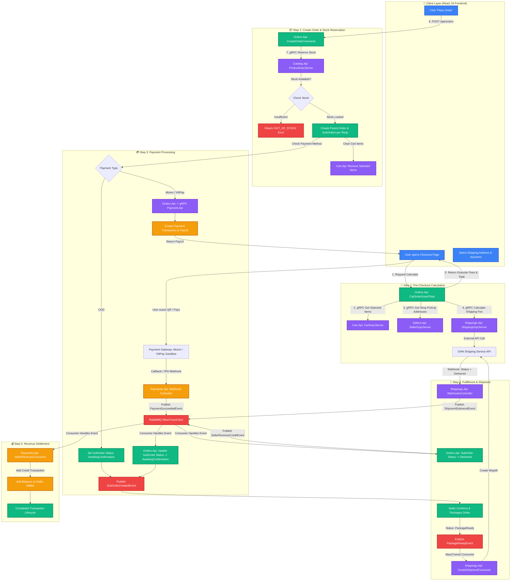
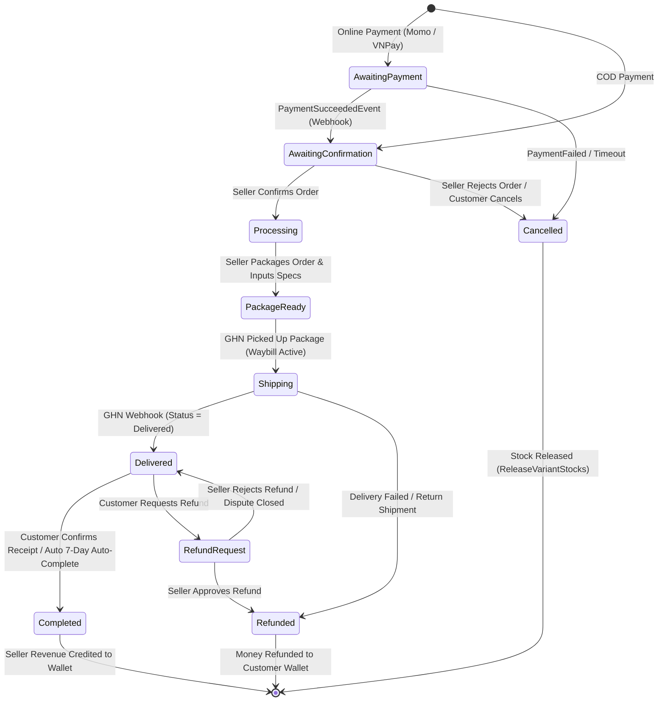

# 03. End-to-End Checkout & Order Lifecycle Flowchart

This document details the complete transaction lifecycle for Order Checkout, Shipping Fee Calculation, Payment Gateways (Momo/VNPay/COD), GHN Shipment creation, and Seller Revenue Settlement using **Mermaid.js**.

> 💡 **Tip**: You can copy-paste any Mermaid block below into [Mermaid Live Editor](https://mermaid.live/) or view directly in GitHub / VS Code / Antigravity IDE to export as PNG/SVG or customize the diagram!

---

## 📊 1. Detailed System Checkout & Order Flowchart

---

## 🔄 2. State Machine Transition Diagram (SubOrder Status)

---

## 📑 3. Step-by-Step Sequence Summary

| Step | Action | Protocol / Technology | Component Involved |
| :--- | :--- | :--- | :--- |
| **1** | Calculate Grand Total | gRPC | `Orders.Api` ➔ `Cart.Api`, `Sellers.Api`, `Shippings.Api` (GHN API) |
| **2** | Reserve Stock | gRPC | `Orders.Api` ➔ `Catalog.Api` (`ReserveVariantStocks`) |
| **3** | Create Order & SubOrders | SQL Transaction | `Orders.Api` (Splits 1 Order into N SubOrders by `ShopId`) |
| **4** | Initiate Online Payment | REST / gRPC | `Orders.Api` ➔ `Payments.Api` (Momo / VNPay PayUrl) |
| **5** | Payment Webhook Callback | HTTP Webhook | Momo/VNPay ➔ `Payments.Api` ➔ MassTransit `PaymentSucceededEvent` |
| **6** | Confirm & Package Ready | CQRS Command | `Orders.Api` ➔ Seller confirms order & sets `PackageReady` |
| **7** | Create GHN Shipment | Event Consumer | MassTransit `CreateShipmentConsumer` ➔ `Shippings.Api` ➔ GHN API |
| **8** | Delivery Webhook | HTTP Webhook | GHN API ➔ `Shippings.Api` ➔ MassTransit `ShipmentDeliveredEvent` |
| **9** | Revenue Settlement | Event Consumer | `Orders.Api` ➔ MassTransit `SellerRevenueCreditEvent` ➔ `Payments.Api` Wallet |
