# 🛒 KIẾN TRÚC & SƠ ĐỒ LUỒNG ĐƠN HÀNG (ORDER FLOW ARCHITECTURE)
> **Dự án**: Ecommerce Microservices (.NET 9 + MassTransit/RabbitMQ + React 19 + GHN Logistics)  

> **Dán mã** : [https://mermaid.live/](https://mermaid.live/)
---

## 📑 Mục Lục
1. [Sơ Đồ Tổng Quan Vòng Đời Đơn Hàng (Architecture Overview)](#1-sơ-đồ-tổng-quan-vòng-đời-đơn-hàng-dễ-hiểu-cho-mọi-người)
2. [Sơ Đồ Tuần Tự Toàn Diện (End-to-End Sequence Diagram)](#2-sơ-đồ-tuần-tự-toàn-diện-end-to-end)
   - 2.1. Giai đoạn 1: Phỏng tính Checkout & Lưu Session Redis
   - 2.2. Giai đoạn 2: Tạo Đơn Hàng & Giữ Tồn Kho Phân Tán (Distributed Placement)
   - 2.3. Giai đoạn 3: Thanh Toán Trực Tuyến & IPN Webhook (MoMo / VNPay)
   - 2.4. Giai đoạn 4: Vận Hành Đơn Hàng Phía Người Bán & Tích Hợp GHN (Fulfillment)
   - 2.5. Giai đoạn 5: Hoàn Tất Đơn & Giải Ngân Vào Ví Shop (Escrow Payout)
3. [Sơ Đồ Máy Trạng Thái Saga (SubOrder State Machine Saga)](#3-sơ-đồ-máy-trạng-thái-saga-suborderstatemachine)
4. [Sơ Đồ Quy Trình Trả Hàng / Hoàn Tiền (Reverse Logistics & Refund Flow)](#4-sơ-đồ-quy-trình-trả-hàng--hoàn-tiền-reverse-logistics)
5. [Sơ Đồ Hủy Đơn Hàng & Giao Dịch Bù Trừ (Order Cancellation & Compensation)](#5-sơ-đồ-hủy-đơn-hàng--giao-dịch-bù-trừ-order-cancellation)
6. [Sơ Đồ Giao Hàng Thất Bại & Chuyển Hoàn (Delivery Failure & Return to Sender)](#6-sơ-đồ-giao-hàng-thất-bại--chuyển-hoàn-delivery-failure)
7. [Sơ Đồ Đánh Giá Sản Phẩm & Cập Nhật Điểm Uy Tín (Product Review & Rating)](#7-sơ-đồ-đánh-giá-sản-phẩm--cập-nhật-điểm-uy-tín-product-review)
8. [Sơ Đồ Rút Tiền Từ Ví Người Bán (Seller Wallet Withdrawal Flow)](#8-sơ-đồ-rút-tiền-từ-ví-người-bán-seller-wallet-withdrawal)
9. [Sơ Đồ Đăng Ký Cửa Hàng & Duyệt Hồ Sơ KYC (Seller Onboarding & KYC Approval)](#9-sơ-đồ-đăng-ký-cửa-hàng--duyệt-hồ-sơ-kyc-seller-onboarding)
10. [Sơ Đồ Mua Lại Đơn Hàng Nhanh (Re-order Flow)](#10-sơ-đồ-mua-lại-đơn-hàng-nhanh-re-order-flow)

---

## 1. Sơ Đồ Tổng Quan Vòng Đời Đơn Hàng (Dễ Hiểu Cho Mọi Người)
Sơ đồ dưới đây được thiết kế trực quan, phân theo **5 Bước Đời Thực** (từ lúc Khách chọn đồ đến khi Tiền về ví Shop), giúp bất kỳ ai (kể cả người không rành kỹ thuật) cũng có thể hiểu rõ luồng vận hành chỉ trong 2 phút:

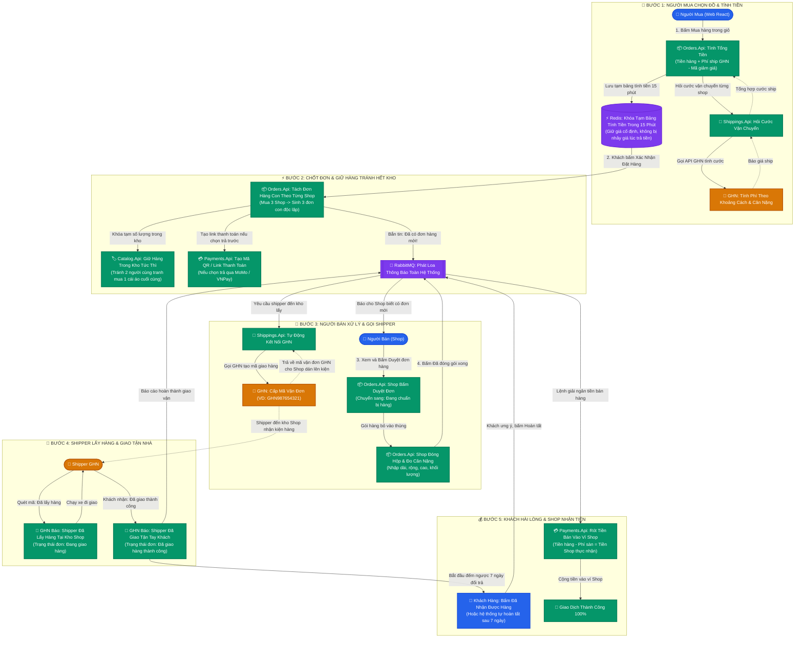

---

## 2. Sơ Đồ Tuần Tự Toàn Diện (End-to-End)

### 2.1. Giai đoạn 1: Phỏng tính Checkout & Lưu Session Redis
Khách hàng chọn danh sách sản phẩm từ giỏ hàng, áp dụng Voucher và địa chỉ giao hàng. Hệ thống tính toán chi tiết phí ship từng shop và giảm giá, sau đó lưu snapshot vào Redis trong 15 phút để đảm bảo giá không bị thay đổi bất ngờ lúc thanh toán.

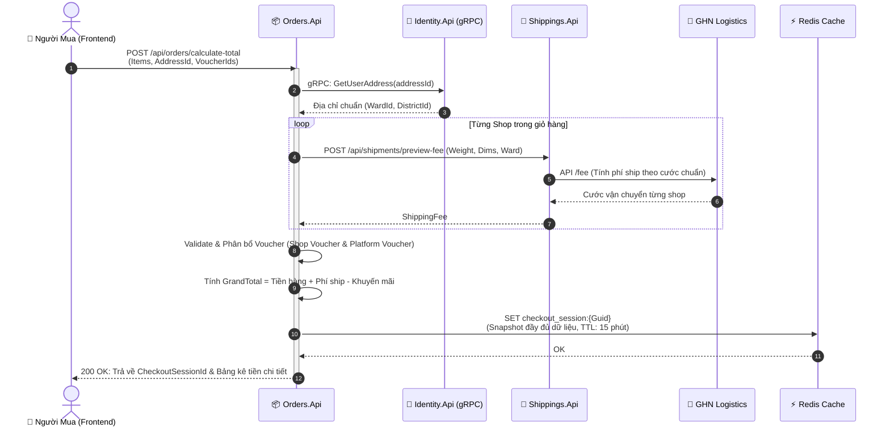

---

### 2.2. Giai đoạn 2: Tạo Đơn Hàng & Giữ Tồn Kho Phân Tán (Distributed Placement)
Khi người dùng bấm **"Đặt hàng"**, hệ thống thực hiện Saga phân tán để đảm bảo không bị overselling (bán quá số lượng tồn kho) và tách một đơn hàng mẹ (`Order`) thành nhiều đơn hàng con (`SubOrder`) theo từng Shop.

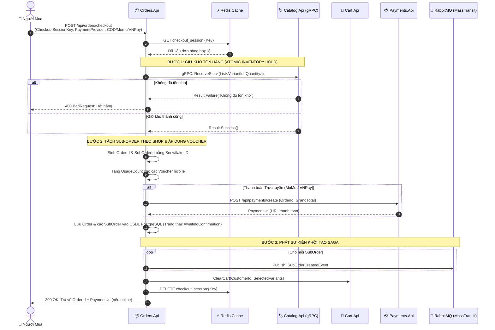

---

### 2.3. Giai đoạn 3: Thanh Toán Trực Tuyến & IPN Webhook (MoMo / VNPay)

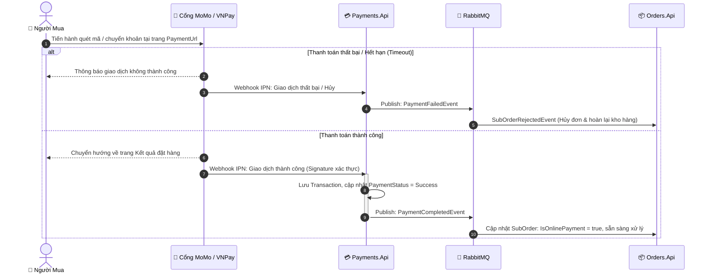

---

### 2.4. Giai đoạn 4: Vận Hành Đơn Hàng Phía Người Bán & Tích Hợp GHN (Fulfillment)
Quy trình từ lúc Người bán xác nhận đơn, đóng gói hàng, hệ thống tự động sinh vận đơn GHN, đến khi Shipper lấy hàng và giao tận tay Người mua.

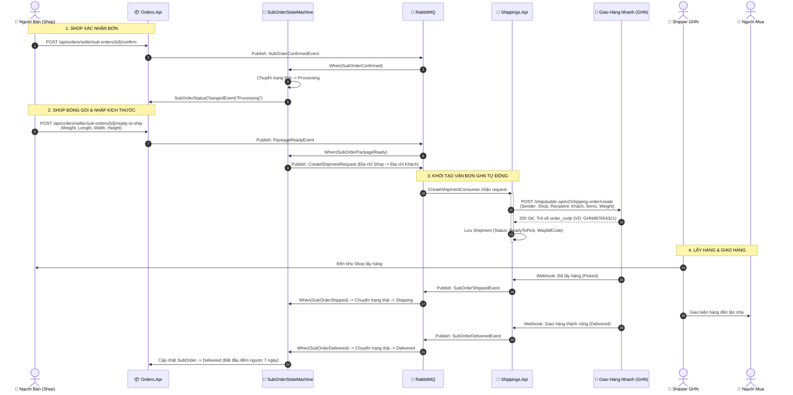

---

### 2.5. Giai đoạn 5: Hoàn Tất Đơn & Giải Ngân Vào Ví Shop (Escrow Payout)
Cơ chế ký quỹ bảo vệ người mua: tiền hàng tạm thời do sàn giữ. Sau khi nhận hàng (người mua bấm xác nhận hoặc sau 7 ngày không khiếu nại), hệ thống tự động giải ngân tiền hàng vào ví người bán sau khi trừ phí hoa hồng sàn.

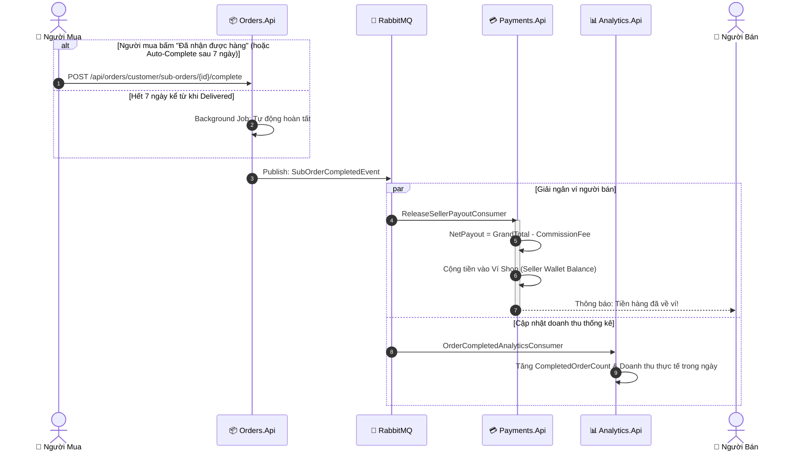

---

## 3. Sơ Đồ Máy Trạng Thái Saga (`SubOrderStateMachine`)
Toàn bộ chu trình vận hành một đơn hàng con (`SubOrder`) được quản lý nghiêm ngặt thông qua **MassTransit State Machine Saga**:

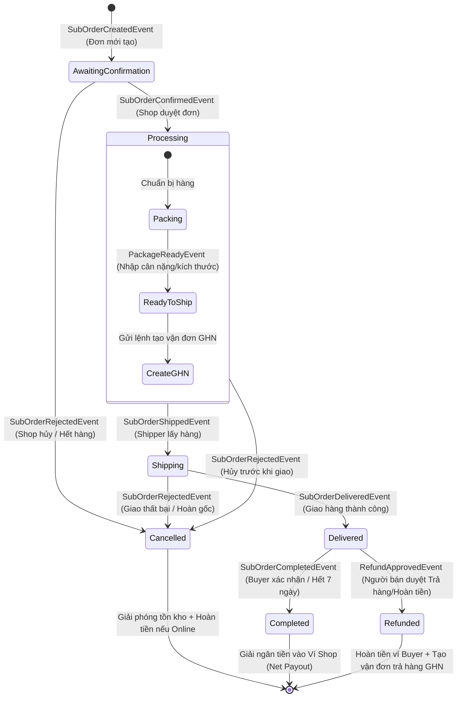

---

## 4. Sơ Đồ Quy Trình Trả Hàng / Hoàn Tiền (Reverse Logistics)
Quy trình khi khách hàng khiếu nại, người bán thẩm định hình ảnh/video bằng chứng, duyệt hoàn trả và hệ thống tự động kích hoạt đơn vận chuyển hàng về kho shop:

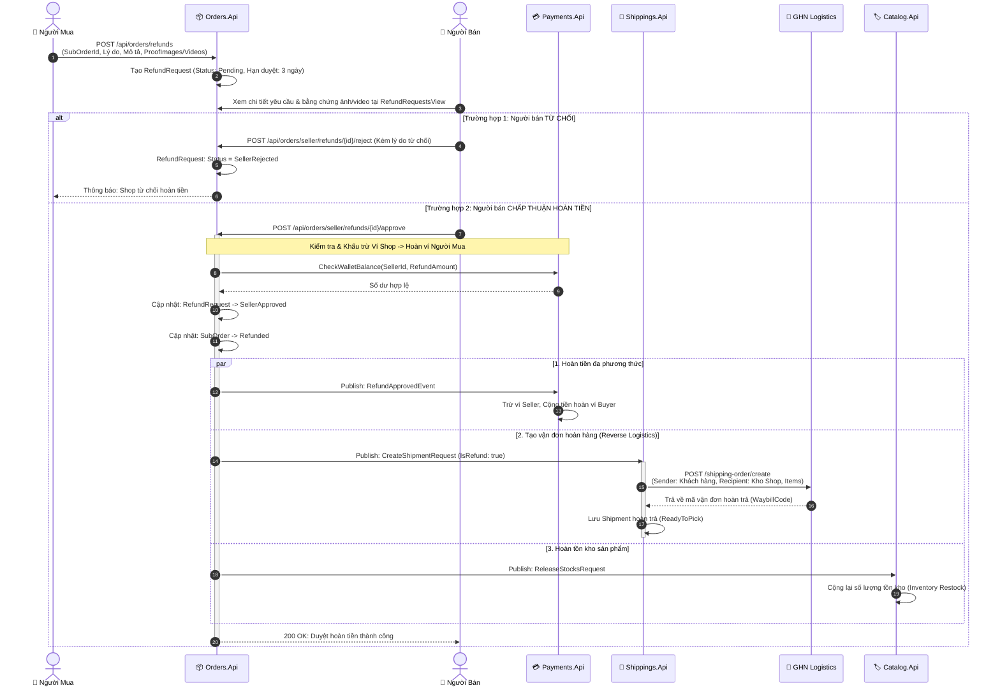

---

## 5. Sơ Đồ Hủy Đơn Hàng & Giao Dịch Bù Trừ (Order Cancellation & Compensation)
> **Bối cảnh**: Người mua bấm "Hủy đơn" khi đơn chưa được Shop gửi đi (trạng thái `AwaitingConfirmation` hoặc `Processing`), hoặc Người bán bấm "Từ chối đơn / Hết hàng" (`SubOrderRejectedEvent`).  
> **Thách thức kiến trúc**: Hệ thống phân tán cần đảm bảo không bị thất thoát tiền và lệch số lượng tồn kho (Eventual Consistency).

```mermaid
sequenceDiagram
    autonumber
    actor Actor as 👤 Người Mua / 🏪 Người Bán
    participant Orders as 📦 Orders.Api
    participant Saga as 🔄 SubOrderStateMachine
    participant RabbitMQ as 📨 RabbitMQ
    participant Payments as 💳 Payments.Api
    participant Catalog as 🏷️ Catalog.Api

    Actor->>Orders: POST /sub-orders/{id}/cancel (Kèm lý do hủy)
    activate Orders
    Orders->>RabbitMQ: Publish: SubOrderRejectedEvent (SubOrderId, Reason)
    deactivate Orders

    RabbitMQ->>Saga: When(SubOrderRejected)
    activate Saga
    Saga->>Saga: Ghi nhận FailureReason & Chuyển trạng thái -> Cancelled

    par 1. Bù trừ hoàn tiền (Nếu đã thanh toán online)
        Saga->>RabbitMQ: Publish: RefundSubOrderBeforeDeliveredRequest
        RabbitMQ->>Payments: Xử lý hoàn 100% tiền đơn hàng
        Payments->>Payments: Cộng tiền vào Ví Buyer (hoặc Refund qua Cổng MoMo/VNPay)
    and 2. Bù trừ hoàn trả tồn kho sản phẩm
        Saga->>RabbitMQ: Publish: ReleaseStocksRequest (VariantItems)
        RabbitMQ->>Catalog: ReleaseStocksConsumer
        Catalog->>Catalog: Cộng lại số lượng tồn kho (Atomic Stock Increment)
    and 3. Bù trừ Voucher đã áp dụng
        Saga->>Orders: Hoàn lại lượt dùng Voucher (Giảm UsageCount)
    end
    deactivate Saga

    Orders-->>Actor: Thông báo: Đơn hàng đã hủy thành công & Tiền/Kho đã hoàn tất!
```
**Chú thích chi tiết**:
- **Ai thao tác**: Khách hàng (đổi ý không muốn mua nữa) hoặc Shop (phát hiện rách hàng, hết tồn kho vật lý).
- **Điều kiện**: Chỉ được hủy khi đơn hàng chưa giao cho Shipper (`CurrentState != Shipping`).
- **Giao dịch bù trừ (Compensating Transactions)**:
  1. *Hoàn tiền*: `Payments.Api` nhận `RefundSubOrderBeforeDeliveredRequest`, tự động trả lại 100% giá trị đơn hàng vào Ví người mua mà không cần shop duyệt thủ công.
  2. *Hoàn kho*: `Catalog.Api` nhận `ReleaseStocksRequest`, lập tức cộng ngược số lượng lại kệ kho.
  3. *Hoàn voucher*: Trừ `UsageCount` của voucher để khách hàng có thể dùng lại mã ưu đãi cho lần mua sau.

---

## 6. Sơ Đồ Giao Hàng Thất Bại & Chuyển Hoàn (Delivery Failure & Return to Sender)
> **Bối cảnh**: Shipper GHN đi giao hàng nhưng khách không nghe máy, sai địa chỉ, hoặc khách từ chối nhận hàng không có lý do sau 3 lần giao.

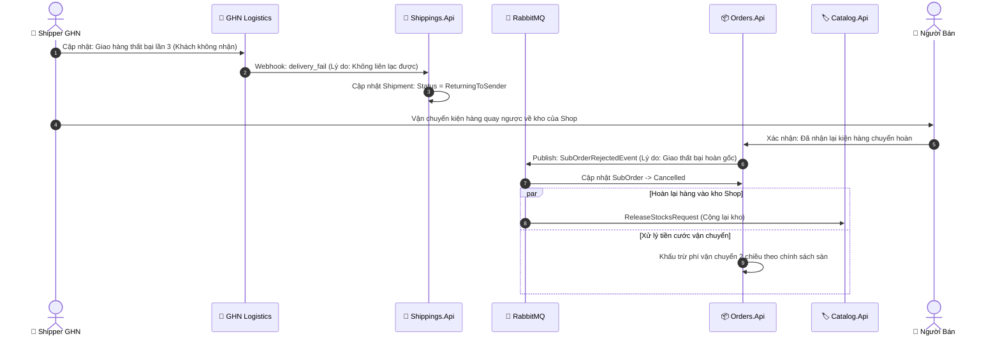
**Chú thích chi tiết**:
- **Ai thao tác**: Shipper GHN & Hệ thống Webhook tự động.
- **Quy trình xử lý**: Hàng hóa không bị mất mà được chuyển hoàn về kho người bán. Khi người bán bấm xác nhận đã nhận lại kiện hàng nguyên vẹn, hệ thống mới chính thức đóng đơn (`Cancelled`) và hoàn trả số lượng vào kho `Catalog.Api`.

---

## 7. Sơ Đồ Đánh Giá Sản Phẩm & Cập Nhật Điểm Uy Tín (Product Review & Rating)
> **Bối cảnh**: Sau khi đơn hàng hoàn tất (`Completed`), khách hàng chấm điểm sao, nhận xét trải nghiệm và tải ảnh chụp thực tế để chia sẻ cho cộng đồng.

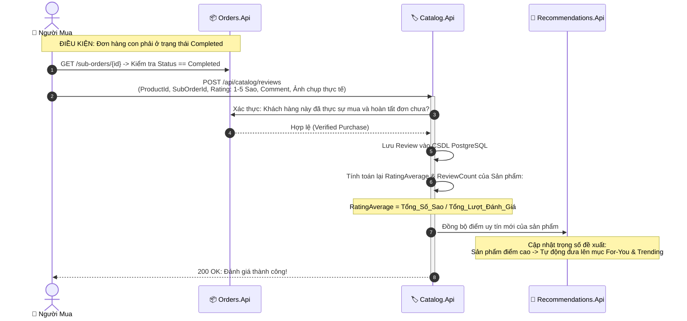
**Chú thích chi tiết**:
- **Chống Review ảo (Verified Purchase)**: `Catalog.Api` xác thực chéo với `Orders.Api` đảm bảo chỉ tài khoản đã mua và hoàn tất đơn hàng thật mới được để lại đánh giá.
- **Thuật toán Đề xuất**: Điểm trung bình sao (`RatingAverage`) được bắn sang `Recommendations.Api` để quyết định sản phẩm có được hiển thị trên trang chủ mục **"Dành Cho Bạn (For You)"** và **"Xu Hướng 24h"** hay không.

---

## 8. Sơ Đồ Rút Tiền Từ Ví Người Bán (Seller Wallet Withdrawal Flow)
> **Bối cảnh**: Doanh thu sau khi trừ phí sàn tích lũy trong Ví người bán (`Seller Wallet`). Người bán tạo lệnh rút tiền về tài khoản ngân hàng cá nhân (Vietcombank, MB, Techcombank...).

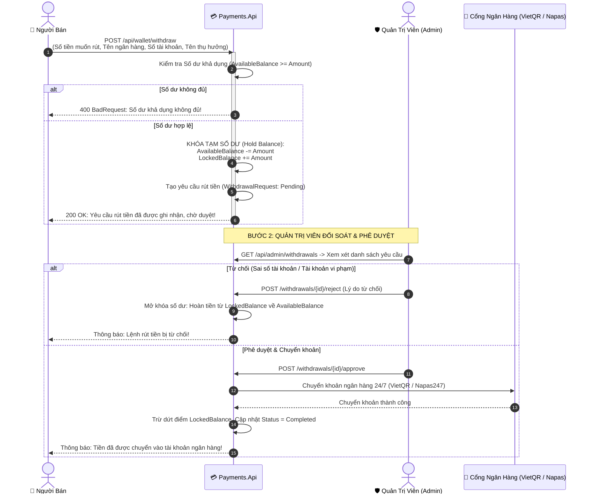
**Chú thích chi tiết**:
- **Cơ chế Khóa số dư (Balance Hold)**: Ngay khi tạo lệnh rút tiền, hệ thống trừ ngay vào `AvailableBalance` và chuyển vào `LockedBalance`. Điều này ngăn chặn Shop tạo 2 lệnh rút cùng một số tiền cùng lúc (Double Spending).
- **Đối soát 2 vòng**: Yêu cầu rút tiền bắt buộc phải qua Admin kiểm tra gian lận (Fraud detection) trước khi giải ngân ra hệ thống ngân hàng thật.

---

## 9. Sơ Đồ Đăng Ký Cửa Hàng & Duyệt Hồ Sơ KYC (Seller Onboarding & KYC Approval)
> **Bối cảnh**: Khách hàng thông thường muốn mở gian hàng kinh doanh trên sàn thương mại điện tử. Hệ thống yêu cầu xác minh danh tính (KYC) để phòng chống lừa đảo.

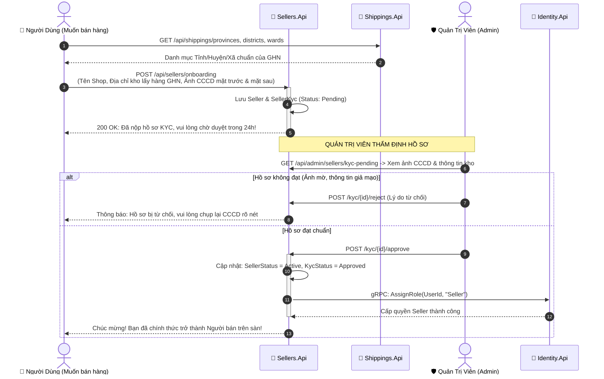
**Chú thích chi tiết**:
- **Chuẩn hóa Địa chỉ kho ngay từ đầu**: Khi đăng ký Shop, địa chỉ kho lấy hàng bắt buộc phải chọn theo danh mục chuẩn của GHN (`WardId`, `DistrictId`). Điều này đảm bảo khi có đơn hàng, hệ thống có thể lập tức gọi API tính cước và sinh mã vận đơn GHN mà không bao giờ bị lỗi sai địa chỉ.
- **Nâng cấp quyền tự động (RBAC)**: Khi Admin bấm duyệt, `Sellers.Api` giao tiếp qua gRPC với `Identity.Api` để gán thêm quyền `Role = Seller` cho tài khoản người dùng mà không cần người dùng phải đăng ký tài khoản mới.

---

## 10. Sơ Đồ Mua Lại Đơn Hàng Nhanh (Re-order Flow)
> **Bối cảnh**: Người mua muốn mua lại nhanh chóng các sản phẩm từ một đơn hàng đã từng đặt trong quá khứ mà không cần phải tìm kiếm lại từng món trên trang chủ.

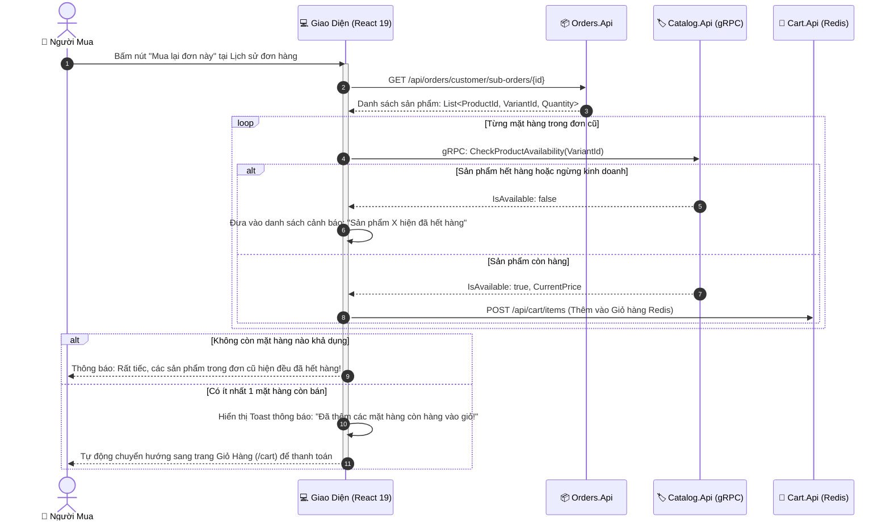
**Chú thích chi tiết**:
- **Kiểm tra tồn kho thời gian thực**: Giá cả và tồn kho của sản phẩm có thể đã thay đổi so với thời điểm mua trong quá khứ. Luồng mua lại luôn đối soát với `Catalog.Api` để lấy giá mới nhất và chỉ đưa các sản phẩm còn tồn kho vào giỏ hàng, bảo vệ khách hàng khỏi việc mua phải mặt hàng đã ngừng kinh doanh.

---

## 🛠️ Hướng Dẫn Sử Dụng & Tùy Chỉnh

1. **Xem trực tiếp trên GitHub/GitLab**: File markdown này tự động hiển thị sơ đồ trực quan sắc nét khi xem trên giao diện web của GitHub repository.
2. **Chỉnh sửa online**:
   - Truy cập [https://mermaid.live](https://mermaid.live).
   - Sao chép bất kỳ khối code nào nằm trong cặp dấu ` ```mermaid ... ``` ` ở trên và dán vào khung bên trái.
   - Bạn có thể đổi tên nhãn, thêm các bước nghiệp vụ, đổi màu sắc theo ý muốn.
   - Bấm **Actions -> Download PNG / SVG** để chèn vào báo cáo đồ án hoặc slide thuyết trình.
3. **Nhúng vào Website của bạn**:
   - Sử dụng thư viện JavaScript `mermaid.js`:
     ```html
     <script type="module">
       import mermaid from 'https://cdn.jsdelivr.net/npm/mermaid@10/dist/mermaid.esm.min.mjs';
       mermaid.initialize({ startOnLoad: true, theme: 'default' });
     </script>
     <div class="mermaid">
       <!-- Dán code Mermaid vào đây -->
     </div>
     ```
